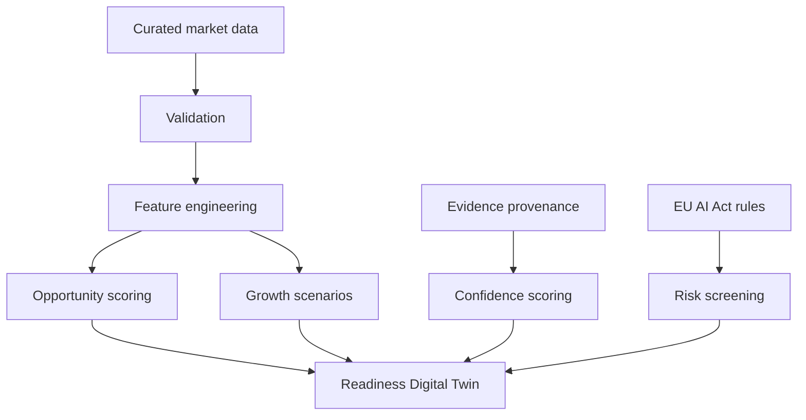

# German AI Market Intelligence Platform

An end-to-end, portfolio-ready **German AI Readiness Digital Twin** that turns AI adoption, investment, sector opportunity, skills pressure, evidence quality, and regulatory readiness into an interactive decision system.

## What makes it unique

Most market dashboards only display charts. This project lets users **change Germany's AI-readiness levers**—skills investment, data infrastructure, public trust, and regulatory clarity—and compare the simulated effect across sectors. It also includes an **Evidence Confidence Lab** that prevents illustrative market estimates from being mistaken for verified statistics.

## Why this project matters

German organisations need to decide **where AI can create value**, **which sectors are ready**, and **what may block adoption**. This project combines descriptive analytics, a transparent opportunity-scoring model, scenario forecasting, and EU AI Act readiness guidance.

> Important: The included CSV is a curated demonstration dataset. Verified observations are marked `observed`; illustrative scenario values are marked `scenario`. Do not present scenario values as official statistics.

## Features

- Market KPI dashboard and 2022–2030 growth scenario
- Sector comparison for manufacturing, healthcare, logistics, finance, and public services
- Explainable AI Opportunity Score
- Interactive AI Readiness Digital Twin and policy simulator
- Evidence Confidence Lab with claim-level provenance labels
- Adoption-barrier analysis: skills, regulation, trust, data readiness, and culture
- EU AI Act risk-screening assistant (educational, not legal advice)
- Recommendations for business leaders and policy teams
- Downloadable scored results
- Unit-tested scoring logic and Docker support

## Architecture



## Opportunity score

The transparent score is calculated on a 0–100 scale:

`0.30 × adoption + 0.25 × growth + 0.20 × investment + 0.15 × talent + 0.10 × trust − regulatory penalty`

All inputs are normalized before weighting. The score is a decision-support heuristic, not a prediction of investment returns.

## Run locally

```bash
python -m venv .venv
source .venv/bin/activate  # Windows: .venv\Scripts\activate
pip install -r requirements.txt
streamlit run app.py
```

## Run tests

```bash
pytest
```

## Docker

```bash
docker build -t german-ai-market-intelligence .
docker run -p 8501:8501 german-ai-market-intelligence
```

## Data notes

The original concept mentioned figures such as a €7.3B market in 2022, €30–33B by 2030, 60% predictive-maintenance use, and 45% healthcare diagnostic support. These should not be repeated as facts without a traceable primary source. This repository therefore separates verified observations from illustrative scenarios.

Examples of stronger public evidence used for context:

- Bitkom Research reported that 20% of surveyed German companies used AI in 2024.
- Bitkom Research reported that 42% of surveyed German industrial companies used AI in production in 2025.
- The European Commission describes the EU AI Act as a risk-based framework with phased application.

See [`data/sources.csv`](data/sources.csv) for links, dates, and evidence labels.

## Recruiter-ready project explanation

> I built a German AI Readiness Digital Twin that converts fragmented adoption, investment, talent, trust, and regulatory indicators into interactive policy scenarios. Users can adjust four readiness levers and compare sector-level effects through a transparent scoring model. I also designed an Evidence Confidence Lab to separate observed facts from derived and scenario data, plus an EU AI Act screening assistant for responsible deployment.

## Suggested resume bullet

- Engineered a Streamlit-based German AI Readiness Digital Twin with four adjustable policy levers, explainable sector scoring, evidence-provenance confidence, market scenarios, EU AI Act screening, automated tests, and Docker deployment.

## Responsible-use statement

This tool supports exploration and prioritisation. It does not provide investment, employment, or legal advice. Users must verify current statistics and seek qualified legal advice for AI Act compliance decisions.

## Tech stack

Python, pandas, NumPy, Plotly, Streamlit, pytest, Docker.
